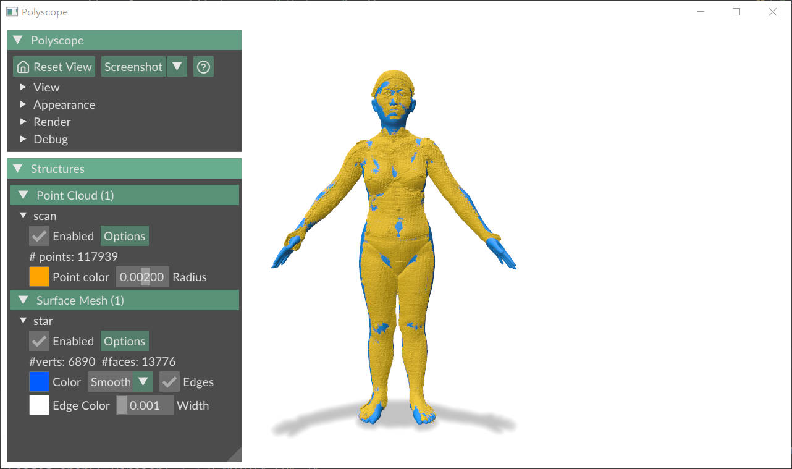
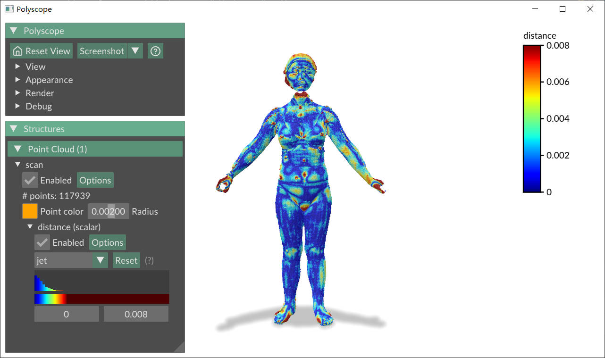

# Visualize Hausdorff Distance

Visualize Hausdorff Distance between two meshes using Polyscope and Pymeshlab(Python3.10)
1. [Pymeshlab](https://pymeshlab.readthedocs.io/en/latest/)
2. [Polyscope](https://polyscope.run/py/)

---
Visualize mesh

Visualize Hausdorff Distance

Visualize pointcloud

Visualize Hausdorff Distance

